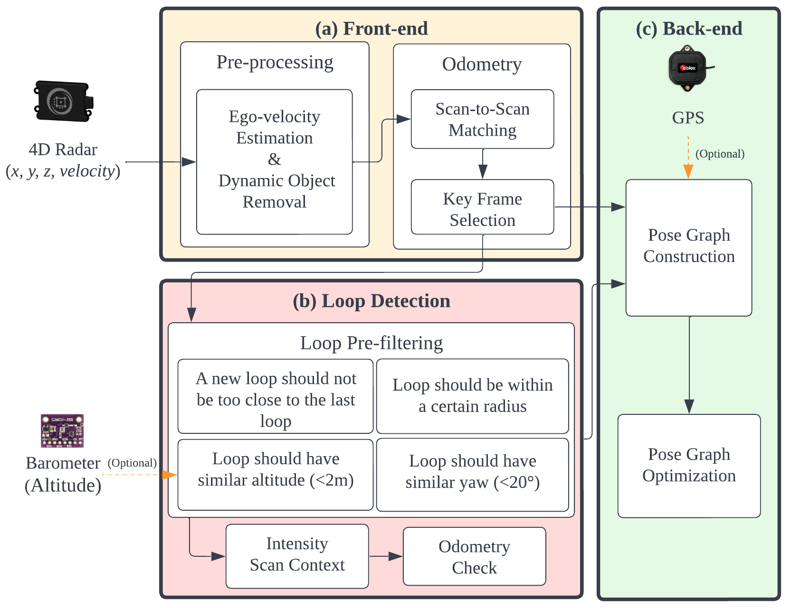
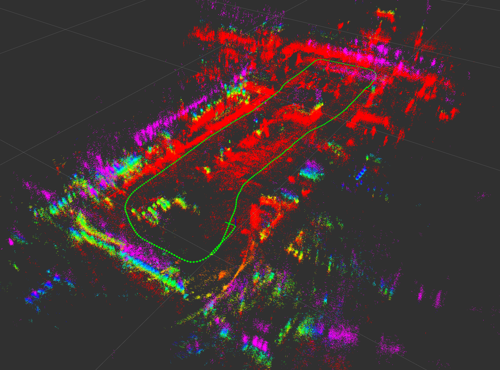

# 4DRadarSLAM
## A 4D Imaging Radar SLAM System for Large-scale Environments based on Pose Graph Optimization
***4DRadarSLAM*** is an open source ROS package for real-time 6DOF SLAM using a 4D Radar. It is based on 3D Graph SLAM with Uncertainty GICP scan matching-based odometry estimation and Intensity Scan Context loop detection. It also supports several graph constraints, such as GPS. We have tested this package with ***Oculli Eagle*** in outdoor structured (buildings), unstructured (trees and grasses) and semi-structured environments.

4DRadarSLAM can operate in adverse wheather. We did a experiment in which sensors are covered by dense smoke. The Lidar SLAM (R2LIVE) failed, but our 4DRadarSLAM is not affected by it, thanks to the penetration of millimeter waves to small objects such as smoke and rain.

<p align='center'>
    
</p>

## 1. Dependency
### 1.1 **Ubuntu** and **ROS**
Ubuntu 64-bit 18.04 or 20.04.
ROS Melodic or Noetic. [ROS Installation](http://wiki.ros.org/ROS/Installation):

### 1.2 ***4DRadarSLAM*** requires the following libraries:
- Eigen3
- OpenMP
- PCL
- g2o
### 1.3 The following ROS packages are required:
- geodesy
- nmea_msgs
- pcl_ros
- Our modified [fast_ugicp](https://github.com/zhuge2333/fast_ugicp), in which Uncertainty GICP algorithum module is added. The original is [fast_gicp](https://github.com/SMRT-AIST/fast_gicp)
```
    sudo apt-get install ros-XXX-geodesy ros-XXX-pcl-ros ros-XXX-nmea-msgs ros-XXX-libg2o
```
**NOTICE:** remember to replace "XXX" on above command as your ROS distributions, for example, if your use ROS-noetic, the command should be:
```
    sudo apt-get install ros-noetic-geodesy ros-noetic-pcl-ros ros-noetic-nmea-msgs ros-noetic-libg2o
```

## 2. System architecture
***4DRadarSLAM*** consists of three nodelets.

- *preprocessing_nodelet*
- *scan_matching_odometry_nodelet*
- *radar_graph_slam_nodelet*

The input point cloud is first downsampled by ***preprocessing_nodelet***, estimate its ego velocity and remove dynamic objects, and then passed to the next nodelets. While scan_matching_odometry_nodelet estimates the sensor pose by iteratively applying a scan matching between consecutive frames (i.e., odometry estimation). The estimated odometry are sent to ***radar_graph_slam***. To compensate the accumulated error of the scan matching, it performs loop detection and optimizes a pose graph which takes various constraints into account.

<div align="center">
    
</div>

## 3. Parameter tuning guide
The mapping quality largely depends on the parameter setting. In particular, scan matching parameters have a big impact on the result. Tune the parameters accoding to the following instructions:

### 3.1 Point cloud registration
- ***registration_method***

This parameter allows to change the registration method to be used for odometry estimation and loop detection. Our code gives five options: ICP, NDT_OMP, FAST_GICP, FAST_UGICP, FAST_VGICP. 

FAST_UGICP is the implementation of our proposed Uncertainty GICP, it utilizes OpenMP for acceleration. Note that FAST_UGICP requires extra parameters.
Point uncertainty parameters:
- ***dist_u***
- ***azimuth_u***
- ***elevation_u***

*dist_u* means the uncertainty of a point’s range measurement at 100m range, *azimuth_u* and *elevation_u* denote the azimuth and elevation angle accuracy (degree)

### 3.2 Loop detection 
- ***accum_distance_thresh***: Minimum distance beteen two edges of the loop
- ***min_loop_interval_dist***: Minimum distance between a new loop edge and the last one
- ***max_baro_difference***: Maximum altitude difference beteen two edges' odometry
- ***max_yaw_difference***: Maximum yaw difference beteen two edges' odometry
- ***odom_check_trans_thresh***: Translation threshold of Odometry Check
- ***odom_check_rot_thresh***: Rotation threshold of Odometry Check
- ***sc_dist_thresh***: Matching score threshold of Scan Context

### 3.3 Other parameters
  All the configurable parameters are available in the launch file. Many are similar to the project ***hdl_graph_slam***.

## 4. Run the package
Download [our recorded rosbag]() and, then
```
roslaunch radar_graph_slam radar_graph_slam.launch
```
You'll see a point cloud like:
<div align="center">
    
</div>
You can choose the dataset to play at end of the launch file.
In our paper, we did evaluation on five datasets, mapping results are presented below:
<div align="center">
    
</div>

## 5. Evaluate the results
In our paper, we use [rpg_trajectory_evaluation](https://github.com/uzh-rpg/rpg_trajectory_evaluation.git), the performance indices used are RE (relative error) and ATE (absolute trajectory error).

## 6. Collect your own datasets
You need a 4D Imaging radar (we use Oculii's Eagle). Also, a barometer (we use BMP388) and GPS/RTK-GPS (we use ZED-F9P) are optional. If you need to compare Lidar SLAM between the algorithum, or use its trajectory as ground truth, calibrating the transform between Radar and Lidar is a precondition.

## 7. Acknowlegement
4DRadarSLAM is based on hdl_graph_slam (Kenji Koide, Jun Miura, and Emanuele Menegatti, A Portable 3D LIDAR-based System for Long-term and Wide-area People Behavior Measurement, Advanced Robotic Systems, 2019).
